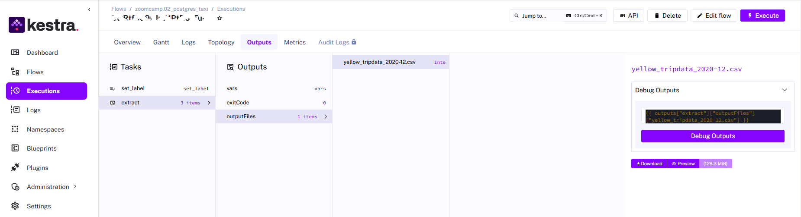
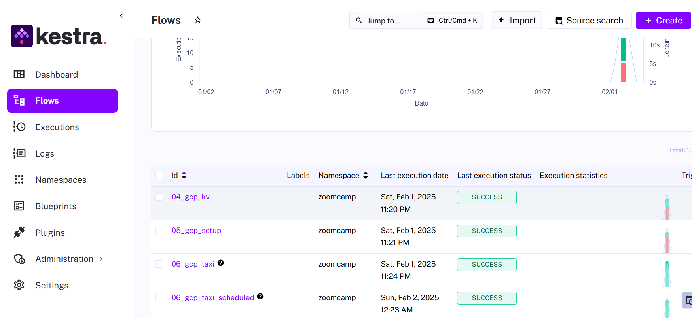
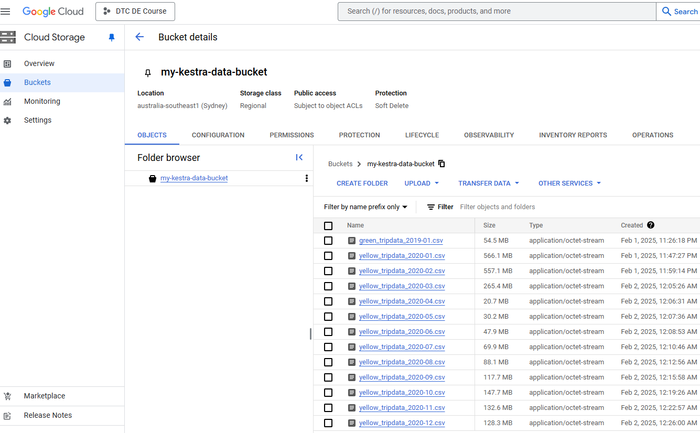
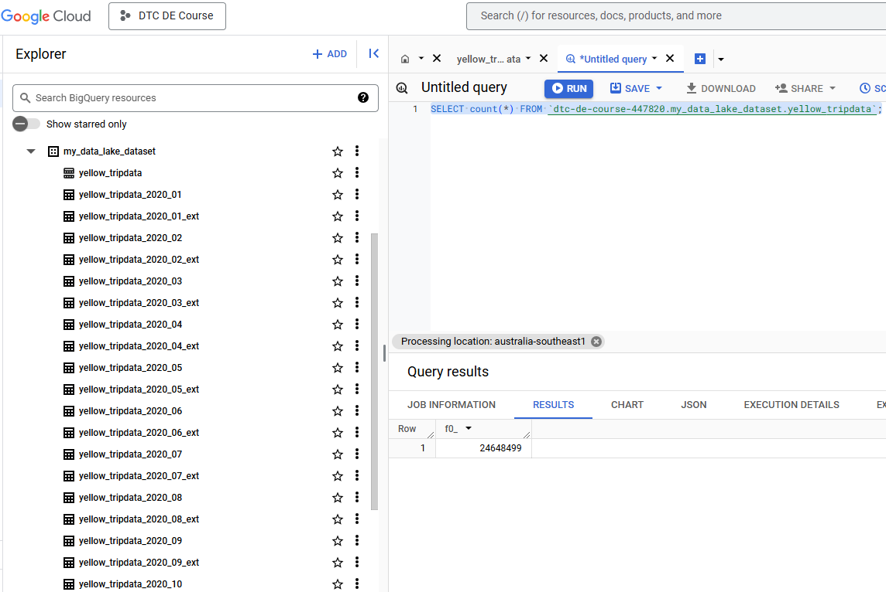

# Module 2 Homework

Note: The yaml file used in Kestra are in flows folder.

Modified 02_postgres_taxi.yaml and 02_postgres_taxi_scheduled.yaml in pluginDefaults.

Modified 04_gcp_kv.yaml with setup in Google Cloud Storage (GCS) and BigQuery.


## Quiz Questions

### 1.

use [02_postgres_taxi.yaml](https://github.com/chenjing2025/de-zcamp/blob/main/02-workflow-orchestration/flows/02_postgres_taxi.yaml)




### 2. (skip as no code for this Question)


### 3.

use: 

[04_gcp_kv.yaml](https://github.com/DataTalksClub/data-engineering-zoomcamp/blob/main/02-workflow-orchestration/flows/04_gcp_kv.yaml)

[05_gcp_setup.yaml](https://github.com/DataTalksClub/data-engineering-zoomcamp/blob/main/02-workflow-orchestration/flows/05_gcp_setup.yaml)

[06_gcp_taxi_scheduled.yaml](https://github.com/DataTalksClub/data-engineering-zoomcamp/blob/main/02-workflow-orchestration/flows/06_gcp_taxi_scheduled.yaml)

```sql
SELECT count(*) FROM `dtc-de-course-447820.my_data_lake_dataset.yellow_tripdata`;
-- 24648499
```

Step 1: Kestra Flow:




Step 2: Google Cloud Storage (GCS) - data lake:




Step 3: BigQuery as a data warehouse：




### 4.

use [02_postgres_taxi_scheduled.yaml](https://github.com/chenjing2025/de-zcamp/blob/main/02-workflow-orchestration/flows/02_postgres_taxi_scheduled.yaml)

```sql
select count(*) from public.green_tripdata;
-- 1734051
```

### 5.

use [02_postgres_taxi_scheduled.yaml](https://github.com/chenjing2025/de-zcamp/blob/main/02-workflow-orchestration/flows/02_postgres_taxi_scheduled.yaml)

```sql
select count(*) from public.yellow_tripdata
where filename = 'yellow_tripdata_2021-03.csv';
-- 1925152
```

or use 
[04_gcp_kv.yaml](https://github.com/DataTalksClub/data-engineering-zoomcamp/blob/main/02-workflow-orchestration/flows/04_gcp_kv.yaml)

[05_gcp_setup.yaml](https://github.com/DataTalksClub/data-engineering-zoomcamp/blob/main/02-workflow-orchestration/flows/05_gcp_setup.yaml)

[06_gcp_taxi.yaml](https://github.com/DataTalksClub/data-engineering-zoomcamp/blob/main/02-workflow-orchestration/flows/06_gcp_taxi.yaml)

Then query like Q3 for yellow_tripdata with 2021-03


### 6.(skip as no code for this Question)
