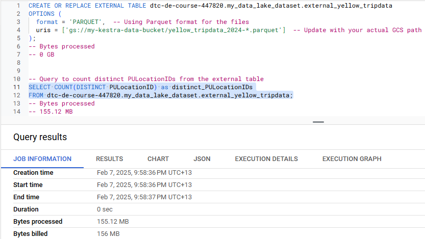
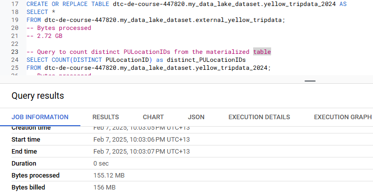

# Module 3 Homework


### Question 1:

```sql
-- Creating an external table in BigQuery referring to your GCS bucket
CREATE OR REPLACE EXTERNAL TABLE `dtc-de-course-447820.my_data_lake_dataset.external_yellow_tripdata`
OPTIONS (
  format = 'PARQUET',  -- Using Parquet format for the files
  uris = ['gs://my-kestra-data-bucket/yellow_tripdata_2024-*.parquet']  -- Update with your actual GCS path
);

-- Query to count the number of records in the external table
SELECT COUNT(*) as record_count
FROM `dtc-de-course-447820.my_data_lake_dataset.external_yellow_tripdata`;
-- 20332093
```


### Question 2:

```sql
-- Creating an external table in BigQuery referring to your GCS bucket
CREATE OR REPLACE EXTERNAL TABLE dtc-de-course-447820.my_data_lake_dataset.external_yellow_tripdata
OPTIONS (
  format = 'PARQUET',  -- Using Parquet format for the files
  uris = ['gs://my-kestra-data-bucket/yellow_tripdata_2024-*.parquet']  -- Update with your actual GCS path
);  

-- Query to count distinct PULocationIDs from the external table
SELECT COUNT(DISTINCT PULocationID) as distinct_PULocationIDs
FROM dtc-de-course-447820.my_data_lake_dataset.external_yellow_tripdata;
-- 262
```



```sql
-- Load data from external source into a regular table
CREATE OR REPLACE TABLE dtc-de-course-447820.my_data_lake_dataset.yellow_tripdata_2024 AS
SELECT *
FROM dtc-de-course-447820.my_data_lake_dataset.external_yellow_tripdata;

-- Query to count distinct PULocationIDs from the materialized table
SELECT COUNT(DISTINCT PULocationID) as distinct_PULocationIDs
FROM dtc-de-course-447820.my_data_lake_dataset.yellow_tripdata_2024;
--262
```




### Question 3: (skip as no code for this Question)


### Question 4:

```sql
-- Query to count records where fare_amount is 0 in regular table
SELECT COUNT(*) AS records_with_zero_fare
FROM `dtc-de-course-447820.my_data_lake_dataset.yellow_tripdata_2024`
WHERE fare_amount = 0;
-- 8333

-- Query to count records with fare_amount = 0 in the external table
SELECT COUNT(*) AS records_with_zero_fare
FROM `dtc-de-course-447820.my_data_lake_dataset.external_yellow_tripdata`
WHERE fare_amount = 0;
-- 8333
```

### Question 5: (skip as no code for this Question)


### Question 6:


### Question 7: (skip as no code for this Question)


### Question 8: (skip as no code for this Question)


### (Bonus: Not worth points) Question 9:
