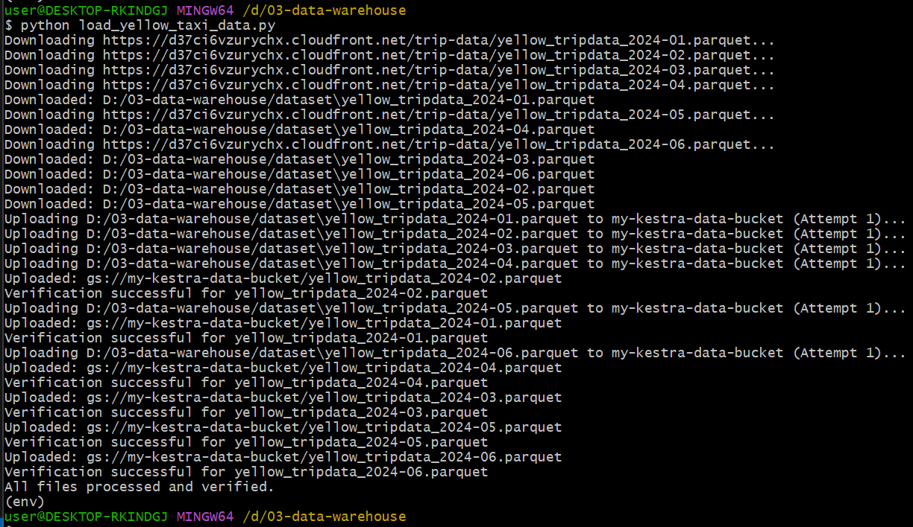
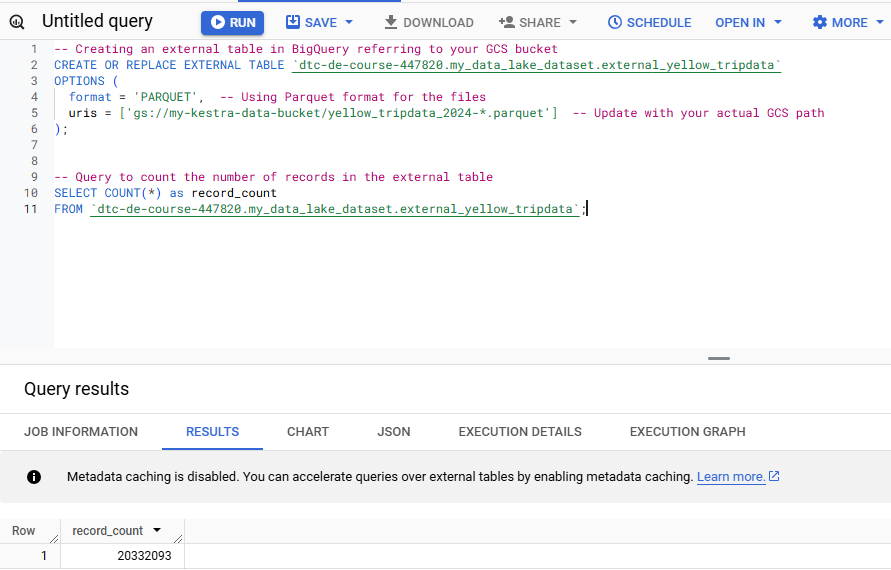

# Module 3 Homework





### Q1.

```sql
-- Creating an external table in BigQuery referring to your GCS bucket
CREATE OR REPLACE EXTERNAL TABLE `dtc-de-course-447820.my_data_lake_dataset.external_yellow_tripdata`
OPTIONS (
  format = 'PARQUET',  -- Using Parquet format for the files
  uris = ['gs://my-kestra-data-bucket/yellow_tripdata_2024-*.parquet']  -- Update with your actual GCS path
);

-- Query to count the number of records in the external table
SELECT COUNT(*) as record_count
FROM `dtc-de-course-447820.my_data_lake_dataset.external_yellow_tripdata`;
-- 20332093
```





### Q2.


### Q3.


### Q4.

```sql
-- Query to count records where fare_amount is 0
SELECT COUNT(*) AS records_with_zero_fare
FROM `dtc-de-course-447820.my_data_lake_dataset.yellow_tripdata_2024`
WHERE fare_amount = 0;
-- 8333

-- Query to count records with fare_amount = 0 in the external table
SELECT COUNT(*) AS records_with_zero_fare
FROM `dtc-de-course-447820.my_data_lake_dataset.external_yellow_tripdata`
WHERE fare_amount = 0;
-- 8333
```

### Q5.


### Q6.


### Q7.


### Q8.
