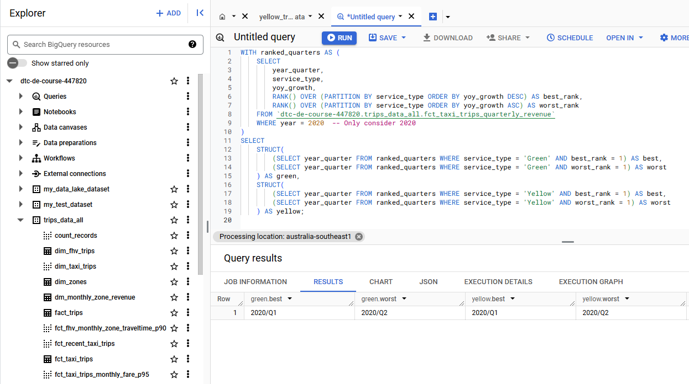
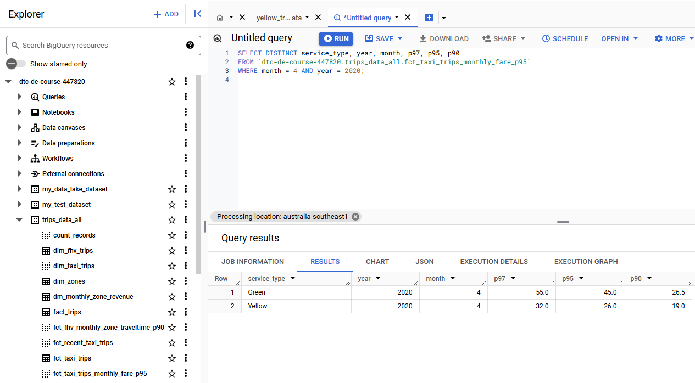
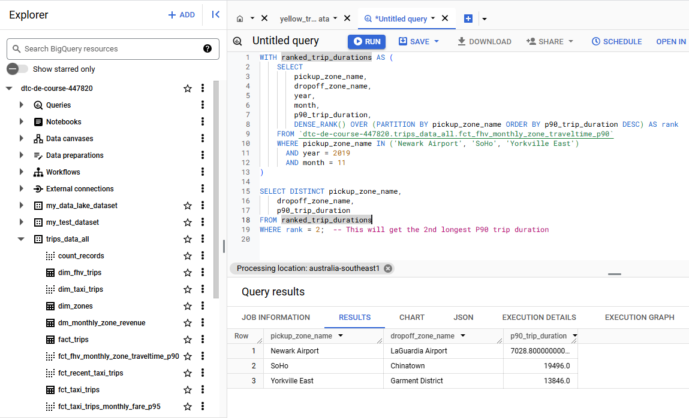

# Module 4 Homework
Goal: Transforming the data loaded in DWH into Analytical Views developing a [dbt project](taxi_rides_ny/README.md).

### Prerequisites

- A running warehouse (BigQuery) 
- A set of running pipelines ingesting the project dataset (week 3 completed web_to_gcs.py)
- The following datasets ingested from the course [Datasets list](https://github.com/DataTalksClub/nyc-tlc-data/): 
  * Yellow taxi data - Years 2019 and 2020
  * Green taxi data - Years 2019 and 2020 
  * fhv data - Year 2019. 

## Question 1: Understanding dbt model resolution

* [select * from myproject.raw_nyc_tripdata.ext_green_taxi]

## Question 2: dbt Variables & Dynamic Models

* [Update the WHERE clause to pickup_datetime >= CURRENT_DATE - INTERVAL '{{ var("days_back", env_var("DAYS_BACK", "30")) }}' DAY]


## Question 3: dbt Data Lineage and Execution

Select the option that does NOT apply for materializing fct_taxi_monthly_zone_revenue:

* [dbt run --select models/staging/+]


## Question 4: dbt Macros and Jinja

* [Setting a value for DBT_BIGQUERY_TARGET_DATASET env var is mandatory, or it'll fail to compile]
* [When using core, it materializes in the dataset defined in DBT_BIGQUERY_TARGET_DATASET]
* [When using stg, it materializes in the dataset defined in DBT_BIGQUERY_STAGING_DATASET, or defaults to DBT_BIGQUERY_TARGET_DATASET]
* [When using staging, it materializes in the dataset defined in DBT_BIGQUERY_STAGING_DATASET, or defaults to DBT_BIGQUERY_TARGET_DATASET]


## Question 5: Taxi Quarterly Revenue Growth

DBT Model:

use [fct_taxi_trips_quarterly_revenue.sql](https://github.com/chenjing2025/de-zcamp/blob/main/04-analytics-engineering/taxi_rides_ny/models/core/fct_taxi_trips_quarterly_revenue.sql)

```sql
-- models/core/fct_taxi_trips_quarterly_revenue.sql with YoY
WITH quarterly_revenue AS (
    SELECT
        CAST(EXTRACT(YEAR FROM pickup_datetime) AS INT64) AS year,  
        EXTRACT(QUARTER FROM pickup_datetime) AS quarter,
        CONCAT(CAST(EXTRACT(YEAR FROM pickup_datetime) AS STRING), '/Q', EXTRACT(QUARTER FROM pickup_datetime)) AS year_quarter,
        service_type,  
        SUM(total_amount) AS total_revenue
    FROM {{ ref('fct_taxi_trips') }}
    GROUP BY year, quarter, year_quarter, service_type
),
previous_year_revenue AS (
    SELECT
        CAST(year AS INT64) AS year,  
        quarter,
        service_type,
        total_revenue AS prev_year_revenue
    FROM quarterly_revenue
    WHERE year < (SELECT MAX(year) FROM quarterly_revenue)  -- Include all previous years
)
SELECT
    qr.year,
    qr.quarter,
    qr.year_quarter,
    qr.service_type,  
    qr.total_revenue,
    COALESCE(pyr.prev_year_revenue, 0) AS prev_year_revenue,
    CASE
        WHEN pyr.prev_year_revenue = 0 THEN NULL  
        ELSE (qr.total_revenue - pyr.prev_year_revenue) / pyr.prev_year_revenue * 100
    END AS yoy_growth
FROM quarterly_revenue qr
LEFT JOIN previous_year_revenue pyr
    ON qr.quarter = pyr.quarter 
    AND qr.year = pyr.year + 1  
    AND qr.service_type = pyr.service_type
ORDER BY qr.year, qr.quarter, qr.service_type
```

BigQuery

```sql
WITH ranked_quarters AS (
    SELECT 
        year_quarter, 
        service_type, 
        yoy_growth,
        RANK() OVER (PARTITION BY service_type ORDER BY yoy_growth DESC) AS best_rank,
        RANK() OVER (PARTITION BY service_type ORDER BY yoy_growth ASC) AS worst_rank
    FROM `dtc-de-course-447820.trips_data_all.fct_taxi_trips_quarterly_revenue`
    WHERE year = 2020  -- Only consider 2020
)
SELECT 
    STRUCT(
        (SELECT year_quarter FROM ranked_quarters WHERE service_type = 'Green' AND best_rank = 1) AS best,
        (SELECT year_quarter FROM ranked_quarters WHERE service_type = 'Green' AND worst_rank = 1) AS worst
    ) AS green,
    STRUCT(
        (SELECT year_quarter FROM ranked_quarters WHERE service_type = 'Yellow' AND best_rank = 1) AS best,
        (SELECT year_quarter FROM ranked_quarters WHERE service_type = 'Yellow' AND worst_rank = 1) AS worst
    ) AS yellow;
```




## Question 6: P97/P95/P90 Taxi Monthly Fare

DBT Model

use [fct_taxi_trips_monthly_fare_p95.sql](https://github.com/chenjing2025/de-zcamp/blob/main/04-analytics-engineering/taxi_rides_ny/models/core/fct_taxi_trips_monthly_fare_p95.sql)

```sql
-- fct_taxi_trips_monthly_fare_p95.sql
WITH filtered_trips AS (
    SELECT
        service_type,
        EXTRACT(YEAR FROM pickup_datetime) AS year,
        EXTRACT(MONTH FROM pickup_datetime) AS month,
        fare_amount
    FROM {{ ref('fct_taxi_trips') }}
    WHERE fare_amount > 0
        AND trip_distance > 0
        AND payment_type_description IN ('Cash', 'Credit card')
),
percentiles AS (
    SELECT 
        service_type,
        year,
        month,
        PERCENTILE_CONT(fare_amount, 0.97) OVER (PARTITION BY service_type, year, month) AS p97,
        PERCENTILE_CONT(fare_amount, 0.95) OVER (PARTITION BY service_type, year, month) AS p95,
        PERCENTILE_CONT(fare_amount, 0.90) OVER (PARTITION BY service_type, year, month) AS p90
    FROM filtered_trips
)
SELECT * FROM percentiles
```

BigQuery

```sql
SELECT DISTINCT service_type, year, month, p97, p95, p90 
FROM `dtc-de-course-447820.trips_data_all.fct_taxi_trips_monthly_fare_p95`
WHERE month = 4 AND year = 2020;

```



## Question 7: Top #Nth longest P90 travel time Location for FHV

DBT Model

use [stg_fhv_tripdata.sql](https://github.com/chenjing2025/de-zcamp/blob/main/04-analytics-engineering/taxi_rides_ny/models/staging/stg_fhv_tripdata.sql)

```sql
-- stg_fhv_tripdata.sql
{{ config(materialized='view') }}

SELECT
    dispatching_base_num,
    CAST(pickup_datetime AS TIMESTAMP) AS pickup_datetime,
    CAST(dropOff_datetime AS TIMESTAMP) AS dropoff_datetime,
    CAST(PUlocationID AS INT64) AS PUlocationID,  -- Ensure it joins with dim_zones
    CAST(DOLocationID AS INT64) AS DOLocationID,
    SR_Flag,
    Affiliated_base_number
FROM {{ source('staging', 'fhv_tripdata') }}
WHERE dispatching_base_num IS NOT NULL   -- Filter out rows where dispatching_base_num is NULL

```

use [dim_fhv_trips.sql](https://github.com/chenjing2025/de-zcamp/blob/main/04-analytics-engineering/taxi_rides_ny/models/core/dim_fhv_trips.sql)

```sql
-- dim_fhv_trips.sql
{{ config(materialized='table') }}

WITH fhv AS (
    SELECT *
    FROM {{ ref('stg_fhv_tripdata') }}
),
dim_zones as (
    select * from {{ ref('dim_zones') }}
    where borough != 'Unknown'
)

SELECT
    fhv.dispatching_base_num,
    fhv.pickup_datetime,
    fhv.dropOff_datetime,
    fhv.PUlocationID,
    fhv.DOLocationID,
    fhv.SR_Flag,
    fhv.Affiliated_base_number,
    EXTRACT(YEAR FROM fhv.pickup_datetime) AS year,
    EXTRACT(MONTH FROM fhv.pickup_datetime) AS month,
    pz.zone AS pickup_zone_name,  -- Zone information for Pickup
    dz.zone AS dropoff_zone_name -- Zone information for Dropoff
FROM fhv
INNER JOIN dim_zones pz
    ON fhv.PUlocationID = pz.locationid  -- Adjust field names as necessary
INNER JOIN dim_zones dz
    ON fhv.DOLocationID = dz.locationid  -- Adjust field names as necessary

```

use [fct_fhv_monthly_zone_traveltime_p90.sql](https://github.com/chenjing2025/de-zcamp/blob/main/04-analytics-engineering/taxi_rides_ny/models/core/fct_fhv_monthly_zone_traveltime_p90.sql)

```sql
-- fct_fhv_monthly_zone_traveltime_p90.sql
WITH trip_duration_data AS (
    SELECT
        fhv.PUlocationID AS pickup_location_id,      -- Pickup Location ID
        fhv.DOLocationID AS dropoff_location_id,     -- Dropoff Location ID
        fhv.pickup_zone_name,                        -- Pickup Zone Name from dim_fhv_trips
        fhv.dropoff_zone_name,                       -- Dropoff Zone Name from dim_fhv_trips
        fhv.year,                                    -- Year from dim_fhv_trips
        fhv.month,                                   -- Month from dim_fhv_trips
        TIMESTAMP_DIFF(TIMESTAMP(fhv.dropOff_datetime), TIMESTAMP(fhv.pickup_datetime), SECOND) AS trip_duration -- Calculate trip duration in seconds
    FROM {{ ref('dim_fhv_trips') }} fhv
    WHERE fhv.PUlocationID IS NOT NULL
      AND fhv.DOLocationID IS NOT NULL
)

SELECT
    pickup_location_id,
    dropoff_location_id,
    pickup_zone_name,                             -- Include Pickup Zone Name
    dropoff_zone_name,                            -- Include Dropoff Zone Name
    year,
    month,
    PERCENTILE_CONT(trip_duration, 0.90) OVER (PARTITION BY year, month, pickup_location_id, dropoff_location_id) AS p90_trip_duration -- Compute the P90 for each partition
FROM trip_duration_data
ORDER BY year, month, pickup_location_id, dropoff_location_id
```

BigQuery

```sql
WITH ranked_trip_durations AS (
    SELECT
        pickup_zone_name,
        dropoff_zone_name,
        year,
        month,
        p90_trip_duration,
        DENSE_RANK() OVER (PARTITION BY pickup_zone_name ORDER BY p90_trip_duration DESC) AS rank
    FROM `dtc-de-course-447820.trips_data_all.fct_fhv_monthly_zone_traveltime_p90`
    WHERE pickup_zone_name IN ('Newark Airport', 'SoHo', 'Yorkville East')
      AND year = 2019
      AND month = 11
)

SELECT DISTINCT pickup_zone_name,
    dropoff_zone_name,
    p90_trip_duration
FROM ranked_trip_durations
WHERE rank = 2;  -- This will get the 2nd longest P90 trip duration

```




