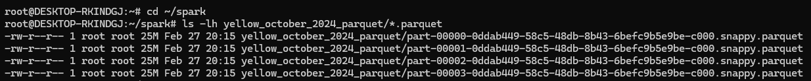

# Module 5 Homework


## Question 1: Install Spark and PySpark

```mark
import pyspark
print(spark.version)
-- 3.3.2
```

## Question 2: Yellow October 2024

```mark
import pyspark
from pyspark.sql import SparkSession

# Initialize Spark session
spark = SparkSession.builder.master("local[*]").appName('test').getOrCreate()

# Read the Parquet file
df = spark.read.parquet("yellow_tripdata_2024-10.parquet")

# Write the DataFrame to Parquet
df.repartition(4).write.parquet("yellow_october_2024_parquet")

print("Data has been written to Parquet successfully.")
-- [Stage 3:=============================>                             (4 + 4) / 8]
-- Data has been written to Parquet successfully.
```

Open Ubuntu:



## Question 3: Count records

```mark
from pyspark.sql.functions import col, to_date

df_filtered = df.filter(to_date(col("tpep_pickup_datetime")) == '2024-10-15')
print(df_filtered.count())
-- 110732
```

## Question 4: Longest trip

```mark
from pyspark.sql.functions import col, unix_timestamp

df_with_duration = df.withColumn(
    "trip_duration_hours",
    (unix_timestamp(col("tpep_dropoff_datetime")) - unix_timestamp(col("tpep_pickup_datetime"))) / 3600
)

df_with_duration.selectExpr("MAX(trip_duration_hours) AS longest_trip").show()

+------------------+
|      longest_trip|
+------------------+
|162.61777777777777|
+------------------+

```

## Question 5: User Interface (skip as no code for this Question)

Spark’s User Interface which shows the application's dashboard runs on which local port?

* 4040

## Question 6: Least frequent pickup location zone

```sql
from pyspark.sql import SparkSession

# Start Spark session
spark = SparkSession.builder.appName("Least Frequent Pickup Location").getOrCreate()

# Load the taxi zone lookup data
zone_lookup_df = spark.read.csv("taxi_zone_lookup.csv", header=True, inferSchema=True)

# Load the Yellow Taxi October 2024 data
yellow_taxi_df = spark.read.parquet("yellow_tripdata_2024-10.parquet")  # Assuming it's in Parquet format

# Show the schema (optional)
zone_lookup_df.printSchema()
yellow_taxi_df.printSchema()

# 25/02/28 22:13:27 WARN Utils: Your hostname, DESKTOP-RKINDGJ resolves to a loopback address: 127.0.1.1; using 10.255.255.254 instead (on interface lo)
# 25/02/28 22:13:27 WARN Utils: Set SPARK_LOCAL_IP if you need to bind to another address
# Setting default log level to "WARN".
# To adjust logging level use sc.setLogLevel(newLevel). For SparkR, use setLogLevel(newLevel).
# 25/02/28 22:13:41 WARN NativeCodeLoader: Unable to load native-hadoop library for your platform... using builtin-java classes where applicable
# 25/02/28 22:13:30 WARN Utils: Service 'SparkUI' could not bind on port 4040. Attempting port 4041.
# root
#  |-- LocationID: integer (nullable = true)
#  |-- Borough: string (nullable = true)
#  |-- Zone: string (nullable = true)
#  |-- service_zone: string (nullable = true)

# root
#  |-- VendorID: integer (nullable = true)
#  |-- tpep_pickup_datetime: timestamp (nullable = true)
#  |-- tpep_dropoff_datetime: timestamp (nullable = true)
#  |-- passenger_count: long (nullable = true)
#  |-- trip_distance: double (nullable = true)
#  |-- RatecodeID: long (nullable = true)
#  |-- store_and_fwd_flag: string (nullable = true)
#  |-- PULocationID: integer (nullable = true)
#  |-- DOLocationID: integer (nullable = true)
#  |-- payment_type: long (nullable = true)
#  |-- fare_amount: double (nullable = true)
#  |-- extra: double (nullable = true)
#  |-- mta_tax: double (nullable = true)
#  |-- tip_amount: double (nullable = true)
#  |-- tolls_amount: double (nullable = true)
#  |-- improvement_surcharge: double (nullable = true)
#  |-- total_amount: double (nullable = true)
#  |-- congestion_surcharge: double (nullable = true)
#  |-- Airport_fee: double (nullable = true)

```

```sql
from pyspark.sql.functions import col, count

# Join taxi data with zone lookup data on PULocationID
joined_df = yellow_taxi_df.join(zone_lookup_df, yellow_taxi_df.PULocationID == zone_lookup_df.LocationID, "left")

# Count the number of trips per pickup zone
zone_counts = joined_df.groupBy("Zone").agg(count("*").alias("trip_count"))

# Find the least frequent pickup zone
least_frequent_zone = zone_counts.orderBy("trip_count").limit(1)

# Show the result
least_frequent_zone.show(truncate=False)

+---------------------------------------------+----------+
|Zone                                         |trip_count|
+---------------------------------------------+----------+
|Governor's Island/Ellis Island/Liberty Island|1         |
+---------------------------------------------+----------+

```


