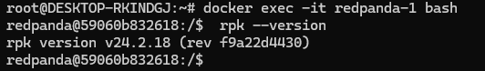
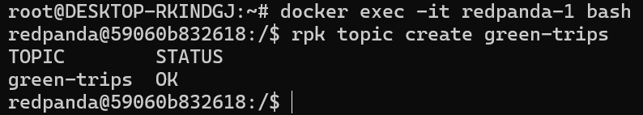
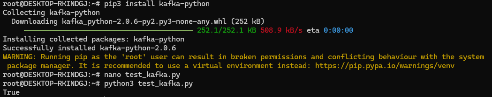
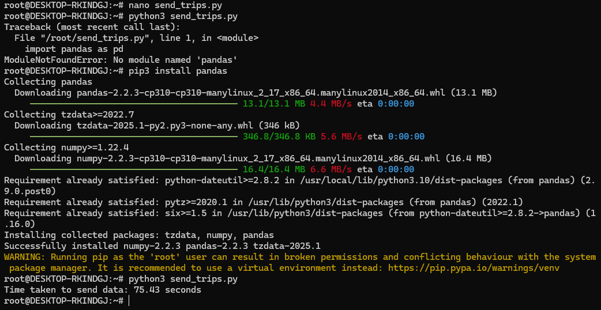

# Module 6 Homework

## Question 1: Redpanda version

## Question 2. Creating a topic

## Question 3. Connecting to the Kafka server

see [test_kafka.py](https://github.com/chenjing2025/de-zcamp/blob/main/06-streaming/test_kafka.py)

## Question 4: Sending the Trip Data

see [send_trips.py](https://github.com/chenjing2025/de-zcamp/blob/main/06-streaming/send_trips.py)

## Question 5: Build a Sessionization Window

see [session_job.py](https://github.com/chenjing2025/de-zcamp/blob/main/06-streaming/session_job.py)

