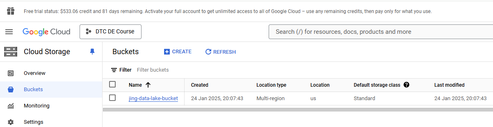
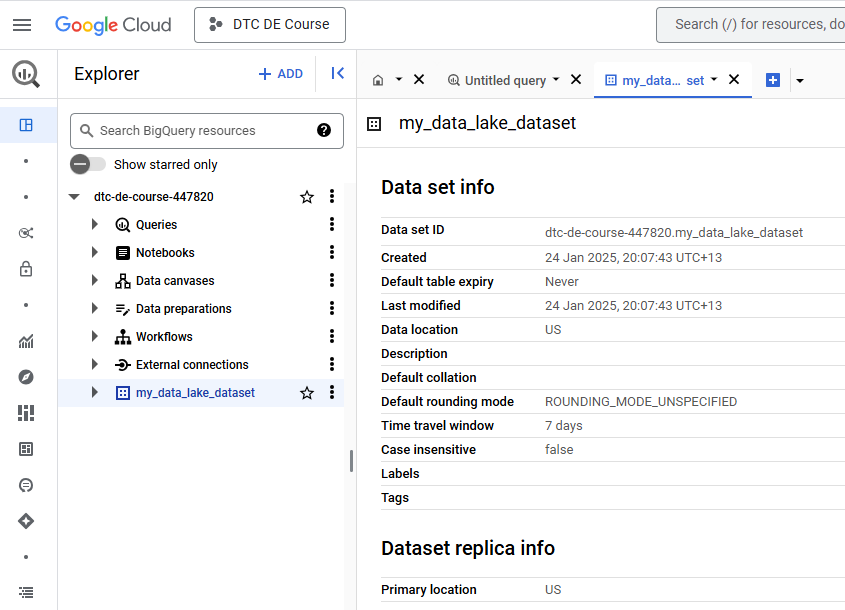
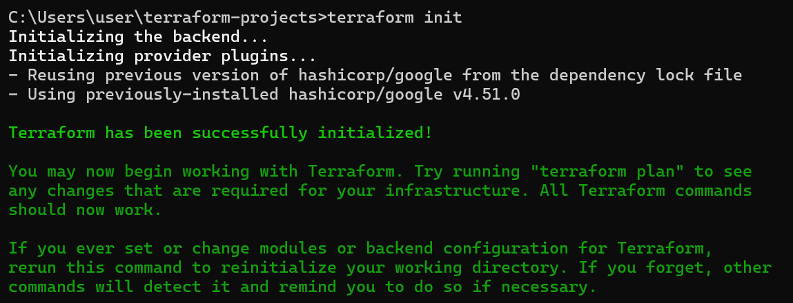
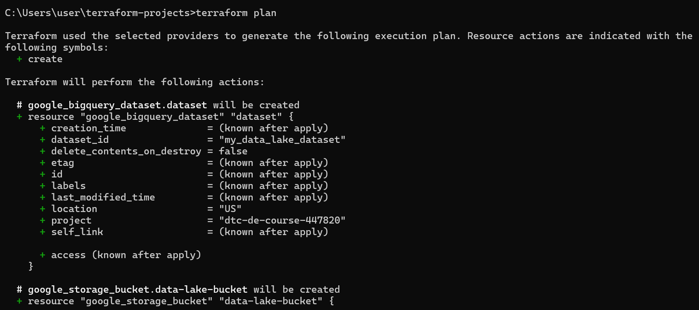
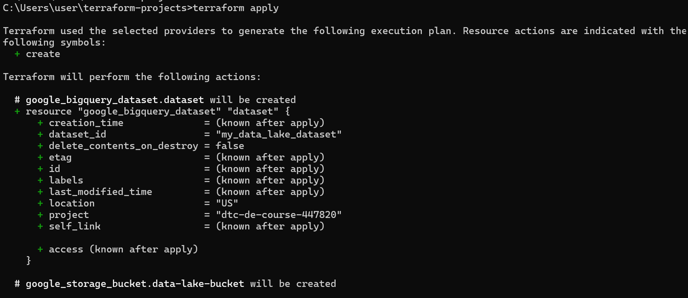
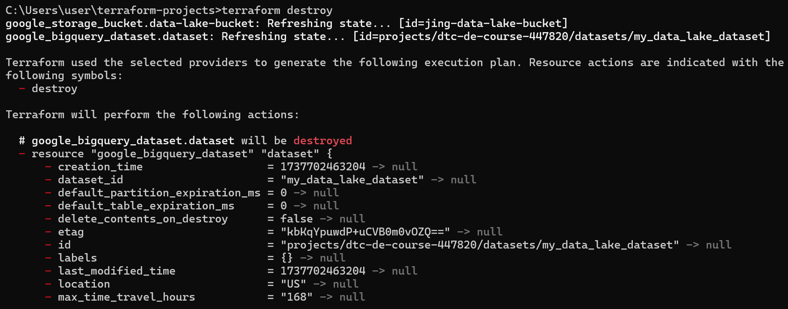

# Module 1 Homework: Docker & SQL

## Question 1. Understanding docker first run

```shell
dataeng@DESKTOP-RKINDGJ:~$ docker run -it --entrypoint bash python:3.12.8
root@1c6d1016d55b:/# pip --version
pip 24.3.1 from /usr/local/lib/python3.12/site-packages/pip (python 3.12)
root@1c6d1016d55b:/#
```

## Question 2. Understanding Docker networking and docker-compose (skip as no code for this Question)

## Prepare Postgres

Postgres Load Data process

Step 1. Install Docker
Download Docker from Docker Desktop.

Step 2. Pull the PostgreSQL Docker Image
```shell
docker pull postgres:latest
```

Step 3. Run PostgreSQL Container
```shell
docker run --name pg_container -e POSTGRES_USER=user_pg -e POSTGRES_PASSWORD=pg_password123 -d -p 5432:5432 postgres:13
```

Step 4. Connect to the PostgreSQL Container
```shell
docker exec -it pg_container psql -U user_pg
```

Step 5. Create a DATABASE
```sql
CREATE DATABASE taxi_data;
```
Step 6. Download the Data

It works once in Git Bash (not sure if the connection problem):
```shell
wget https://github.com/DataTalksClub/nyc-tlc-data/releases/download/green/green_tripdata_2019-10.csv.gz
```
so I use below in cmd
```shell
D:\de_files>curl -L -o green_tripdata_2019-10.csv.gz https://github.com/DataTalksClub/nyc-tlc-data/releases/download/green/green_tripdata_2019-10.csv.gz
D:\de_files>curl -L -o taxi_zone_lookup.csv https://github.com/DataTalksClub/nyc-tlc-data/releases/download/misc/taxi_zone_lookup.csv
```

Step 7. Extract the CSV Files
Gitbash
```shell
user@DESKTOP-RKINDGJ MINGW64 /d/de_files
$ gzip -d green_tripdata_2019-10.csv.gz
```

Copy the File Into the Docker Container
```shell
user@DESKTOP-RKINDGJ MINGW64 /d/de_files
$ docker cp green_tripdata_2019-10.csv pg_container:/green_tripdata_2019-10.csv
```
```shell
dataeng@DESKTOP-RKINDGJ:~$ docker cp taxi_zone_lookup.csv pg_container:/taxi_zone_lookup.csv
```
Checking the green_tripdata_2019-10.csv heading or column for creating table in next step
Ubuntu terminal window
```shell
dataeng@DESKTOP-RKINDGJ:~$ docker exec -it pg_container bash
root@38576051a4d2:/# ls /mnt/data
ls: cannot access '/mnt/data': No such file or directory
root@38576051a4d2:/# ls /mnt/d/de_files
green_tripdata_2019-10.csv.gz
root@38576051a4d2:/# zcat /mnt/d/de_files/green_tripdata_2019-10.csv.gz | csvlook | head -n 5
bash: csvlook: command not found
root@38576051a4d2:/# zcat /mnt/d/de_files/green_tripdata_2019-10.csv.gz | head -n 5
VendorID,lpep_pickup_datetime,lpep_dropoff_datetime,store_and_fwd_flag,RatecodeID,PULocationID,DOLocationID,passenger_count,trip_distance,fare_amount,extra,mta_tax,tip_amount,tolls_amount,ehail_fee,improvement_surcharge,total_amount,payment_type,trip_type,congestion_surcharge
2,2019-10-01 00:26:02,2019-10-01 00:39:58,N,1,112,196,1,5.88,18,0.5,0.5,0,0,,0.3,19.3,2,1,0
1,2019-10-01 00:18:11,2019-10-01 00:22:38,N,1,43,263,1,.80,5,3.25,0.5,0,0,,0.3,9.05,2,1,0
1,2019-10-01 00:09:31,2019-10-01 00:24:47,N,1,255,228,2,7.50,21.5,0.5,0.5,0,0,,0.3,22.8,2,1,0
1,2019-10-01 00:37:40,2019-10-01 00:41:49,N,1,181,181,1,.90,5.5,0.5,0.5,0,0,,0.3,6.8,2,1,0
root@38576051a4d2:/#
```

Step 8. Load Data Into PostgreSQL

8.1 Load the Green Taxi Trips Data Into PostgreSQL

Access PostgreSQL
```shell
docker exec -it pg_container psql -U user_pg -d taxi_data
```

```sql
CREATE TABLE green_taxi_trips (
    VendorID INT,
    lpep_pickup_datetime TIMESTAMP,
    lpep_dropoff_datetime TIMESTAMP,
    store_and_fwd_flag CHAR(1),
    RatecodeID INT,
    PULocationID INT,
    DOLocationID INT,
    passenger_count INT,
    trip_distance NUMERIC,
    fare_amount NUMERIC,
    extra NUMERIC,
    mta_tax NUMERIC,
    tip_amount NUMERIC,
    tolls_amount NUMERIC,
    ehail_fee NUMERIC,
    improvement_surcharge NUMERIC,
    total_amount NUMERIC,
    payment_type INT,
    trip_type INT,
    congestion_surcharge NUMERIC
);

COPY public.green_taxi_trips
FROM '/green_tripdata_2019-10.csv'
DELIMITER ',' 
CSV HEADER;
```

8.2 Load the Taxi Zone Lookup Data Into PostgreSQL

Access PostgreSQL
```shell
docker exec -it pg_container psql -U user_pg -d taxi_data
```

```sql
CREATE TABLE taxi_zone_lookup (
    LocationID INT,
    Borough VARCHAR(255),
    Zone VARCHAR(255),
    service_zone VARCHAR(255)
);
```

COPY public.taxi_zone_lookup
FROM '/taxi_zone_lookup.csv'
DELIMITER ',' 
CSV HEADER;

Step 9. Verify Data Loading
```sql
SELECT COUNT(*) FROM public.green_taxi_trips;
SELECT COUNT(*) FROM public.taxi_zone_lookup;
```

Step 10. Exit the PostgreSQL Container
\q

## Question 3. Trip Segmentation Count

```shell
taxi_data=# SELECT
    COUNT(*) FILTER (WHERE trip_distance <= 1) AS "Up to 1 mile",
    COUNT(*) FILTER (WHERE trip_distance > 1 AND trip_distance <= 3) AS "1 to 3 miles",
    COUNT(*) FILTER (WHERE trip_distance > 3 AND trip_distance <= 7) AS "3 to 7 miles",
    COUNT(*) FILTER (WHERE trip_distance > 7 AND trip_distance <= 10) AS "7 to 10 miles",
    COUNT(*) FILTER (WHERE trip_distance > 10) AS "Over 10 miles"
FROM
    public.green_taxi_trips
WHERE
    lpep_pickup_datetime >= '2019-10-01' AND lpep_pickup_datetime < '2019-11-01';
 Up to 1 mile | 1 to 3 miles | 3 to 7 miles | 7 to 10 miles | Over 10 miles
--------------+--------------+--------------+---------------+---------------
       104830 |       198995 |       109642 |         27686 |         35201
(1 row)
```

## Question 4. Longest trip for each day

```shell
taxi_data=# SELECT
    TO_CHAR(lpep_pickup_datetime, 'YYYY-MM-DD') AS pickup_date,
    MAX(trip_distance) AS longest_trip_distance
FROM
    public.green_taxi_trips
WHERE
    lpep_pickup_datetime >= '2019-10-01' AND lpep_pickup_datetime < '2019-11-01'
GROUP BY
    pickup_date
ORDER BY
    longest_trip_distance DESC
LIMIT 1;
 pickup_date | longest_trip_distance
-------------+-----------------------
 2019-10-31  |                515.89
(1 row)
```

## Question 5. Three biggest pickup zones

```shell
taxi_data=# SELECT
    z.Zone AS pickup_zone,
    SUM(gtt.total_amount) AS total_amount
FROM
    public.green_taxi_trips gtt
JOIN
    public.taxi_zone_lookup z
    ON gtt.pulocationid = z.LocationID  -- Match pulocationid with LocationID
WHERE
    gtt.lpep_pickup_datetime::date = '2019-10-18'
GROUP BY
    pickup_zone
HAVING
    SUM(gtt.total_amount) > 13000
ORDER BY
    total_amount DESC;
     pickup_zone     | total_amount
---------------------+--------------
 East Harlem North   |     18686.68
 East Harlem South   |     16797.26
 Morningside Heights |     13029.79
(3 rows)
```

## Question 6. Largest tip

```shell
SELECT
    dropoff_zone.Zone AS dropoff_zone,
    MAX(gtt.tip_amount) AS largest_tip
FROM
    public.green_taxi_trips gtt
JOIN
    public.taxi_zone_lookup pickup_zone
    ON gtt.pulocationid = pickup_zone.LocationID
JOIN
    public.taxi_zone_lookup dropoff_zone
    ON gtt.dolocationid = dropoff_zone.LocationID
WHERE
    pickup_zone.Zone = 'East Harlem North'
    AND gtt.lpep_pickup_datetime::date BETWEEN '2019-10-01' AND '2019-10-31'
GROUP BY
    dropoff_zone.Zone
ORDER BY
    largest_tip DESC
LIMIT 1;
 dropoff_zone | largest_tip
--------------+-------------
 JFK Airport  |        87.3
(1 row)

```

## Terraform

In this section homework 1, I have done prepared the environment by creating resources in GCP with Terraform.

1. Setup for Terraform and GCP 

a. Install Terraform on Laptop (https://github.com/DataTalksClub/data-engineering-zoomcamp/blob/main/01-docker-terraform/1_terraform_gcp/windows.md)

b. GCP setup (https://github.com/DataTalksClub/data-engineering-zoomcamp/blob/main/01-docker-terraform/1_terraform_gcp/2_gcp_overview.md#initial-setup)

c. Terraform Workshop to create GCP Infra (
https://github.com/DataTalksClub/data-engineering-zoomcamp/blob/main/01-docker-terraform/1_terraform_gcp/1_terraform_overview.md#execution-steps)

3. Copy the files from the course repo to the Laptop.

4. Modify the files (see updated main.tf under terraform_basic folder) and create a GCP Bucket and Big Query Dataset.

GCP Bucket

   
   
   
Big Query Dataset

   

### Execution

```shell
# Refresh service-account's auth-token for this session
gcloud auth application-default login
```

```shell
# Initialize state file (.tfstate)
C:\Users\user>cd C:\Users\user\terraform-projects
C:\Users\user\terraform-projects>terraform init
```

 

```shell
# Check changes to new infra plan
C:\Users\user\terraform-projects>terraform plan
```

 

```shell
# Create new infra
C:\Users\user\terraform-projects>terraform apply
```

 
 
```shell
# Delete infra after your work, to avoid costs on any running services
C:\Users\user\terraform-projects>terraform destroy
```

 

After executing terraform destroy, both the GCP Bucket and Big Query Dataset I created before are removed.


## Question 7. Terraform Workflow (skip as no code for this Question)


